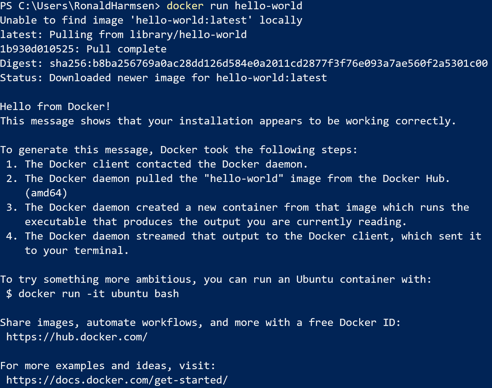
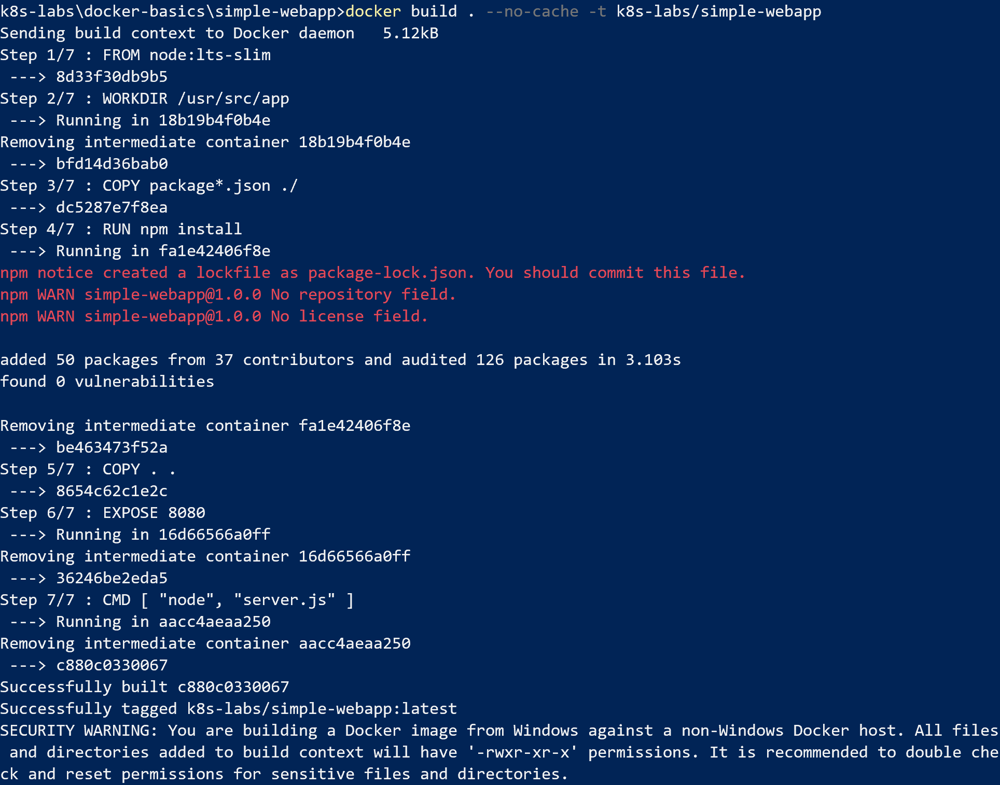
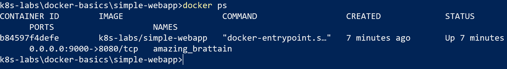
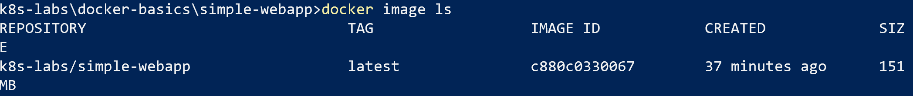

## Docker basics

#### Starting a docker image

Let's start with a very simple command to run a predefined docker image.

`docker run hello-world`

The output of that command explains all the steps that just happened:

#### Building 

Next step would be to build our own image on Docker Desktop.
Look at the source code in the simple-webapp directory in this lab. That contains a very basic NodeJS web application and some setup to test building our own Docker images.

By running the build command, Docker will start processing our recipe in the Dockerfile and create a new image.
`docker build . -t k8s-labs/simple-webapp`

#### Running our web application

Next step would be to run a container based on this image:

`docker run -p 9000:8080 k8s-labs/simple-webapp`

Notice the `-p 9000:8080` option. That means that port 9000 on your localmachine should be forwarded to port 8080 in the docker container. 

Go to your web browser and go to this url: `http://localhost:9000' to see the output.

You might also notice that the command shell now waits for termination. That is because we are running in 'interactive mode'.
By pressing `Ctrl+c` we can terminate this mode. That will leave our container running by the way. We just closed the interactive shell to the application.

By running `docker ps` we can see our container is still running (and refreshing your browser window will also give you the same response).

The last name is automatic for Docker containers. It will generate one itself if you don't give it a name.
There are a couple ways of stopping our container now.

One is to run `docker container stop b84597f4defe`. So by using the container id.
You can also use the first characters (as long as they are unique) `docker container stop b84` or the short form `docker stop b84`

That will only stop the container, it is still there! We can start it again by `docker start b84`. Validate with `docker ps`

`docker container rm b84` will delete it.

Running the docker, we can also give a name ourselves. So after this we can use the name 'webapp' to stop & start.
`docker run -p 9000:8080 -d --name webapp k8s-labs/simple-webapp`

#### Tagging images
We can tag our image (we actually did it already in the build process), so we can provide usefull labels to our container.
Like '1.0.0', 'latest', 'development' etc.

This allows us to have multiple versions/copies of an image available.

We can ask Docker which images are available on this machine: `docker images ls`

Next would be to add a tag to this image: `docker tag k8s-labs/simple-webapp:latest k8s-labs/simple-webapp:1.0.0`

Now if we use `docker images ls` again, we can see that we have another tagged image available, which points to the same image ID.

If we change our server.js file now and rerun the build process we can make another version of this container.

Change the message to the following: ` res.send('Hello world v2\n');`

Now we build another version by running the build command again

`docker build . -t k8s-labs/simple-webapp:2.0.0`

Now we should see a new image ID which is connected to our '2.0.0' tag, while 'latest' is still pointing to 1.0.0.

We can change that by running `docker tag k8s-labs/simple-webapp:2.0.0 k8s-labs/simple-webapp:latest`

Now if we run ` docker run -p 9000:8080 -d --name webapp k8s-labs/simple-webapp` again, we should see the v2 version of the app running. (Or get an error first to cleanup the old webapp container).

Running without the specific tag mentioned takes 'latest' as the default. Of course we can also specify which exact version to run.