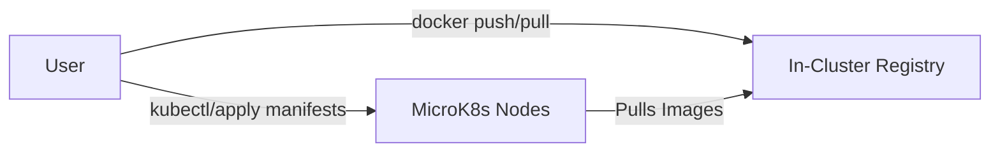

# Lab: Setting Up Minikube with In-Cluster Registry for Air-Gapped Practice

This lab guides you through setting up Minikube on Docker Desktop, running a Docker registry inside your Kubernetes cluster, and configuring Minikube to use it. 
This setup allows practicing air-gapped workflows and later experimenting with Kubernetes in this way.

---

## Prerequisites
- Docker Desktop installed and running
- MicroK8s installed (https://microk8s.io/docs/install-windows)
- kubectl installed

---

## Architecture Overview

Below is a Mermaid diagram showing the relationship between your in-cluster Docker registry and the Minikube Kubernetes cluster:



**Legend:**
- The user interacts with both the in-cluster registry (via NodePort) and the Microk8s cluster.
- Microk8s nodes pull images from the in-cluster registry for workloads.

---


## Step 1: Check Microk8s setup

You can check the new cluster by running 
```sh
kubectl get nodes
```

If this is not working, try this in Powershell
```sh
microk8s config > kubeconfig-microk8s.yaml
$Env:KUBECONFIG=("$HOME\.kube\config;$HOME\kubeconfig-microk8s.yaml"); kubectl config view --flatten | Out-File "$HOME\.kube\config-combined"
mv $HOME\.kube\config $HOME\.kube\config.old
mv $HOME\.kube\config-combined $HOME\.kube\config
```

Then check your configuration in kubectl
```
kubectl config get-contexts
```

it should return something like this: 
```
CURRENT   NAME             CLUSTER            AUTHINFO         NAMESPACE
          docker-desktop   docker-desktop     docker-desktop
*         microk8s         microk8s-cluster   admin
```

If you don't have the microk8s cluster as current, use `kubectl config set-context microk8s` to switch.

After that you can look at the nodes with `kubectl get nodes` to verify you're connected with Microk8s cluster
---

## Step 2: Deploy a Docker Registry Inside the Cluster

Create a file named `incluster-registry.yaml`:

```yaml
apiVersion: v1
kind: Pod
metadata:
  name: registry
  labels:
    app: registry
spec:
  containers:
  - name: registry
    image: registry:2
    ports:
    - containerPort: 5000
      name: registry
    volumeMounts:
    - name: registry-storage
      mountPath: /var/lib/registry
  volumes:
  - name: registry-storage
    emptyDir: {}
---
apiVersion: v1
kind: Service
metadata:
  name: registry
spec:
  type: NodePort
  ports:
  - port: 5000
    targetPort: 5000
    nodePort: 32000
  selector:
    app: registry
```

Apply it:
```sh
kubectl apply -f incluster-registry.yaml
```

This will install a Docker container registry inside your cluster and expose it on port 32000 on all nodes.

---

## Step 3: Push Images to the In-Cluster Registry

1. Get your Cluster Node IP:
   ```sh
   kubectl get nodes -o wide
   ```
   It will return something like this:

    ```
    NAME          STATUS   ROLES    AGE   VERSION    INTERNAL-IP      EXTERNAL-IP   OS-IMAGE             KERNEL-VERSION       CONTAINER-RUNTIME
    microk8s-vm   Ready    <none>   16m   v1.28.15   172.25.214.129   <none>        Ubuntu 22.04.5 LTS   5.15.0-160-generic   containerd://1.6.28
    ```

    The Internal IP is likely the ip address of the VM running your cluster.
    You can verify if you can access the registry by executing, where you change the ip address to whatever the statement above tells you: 
    ```sh
    curl http://<microk8s-ip>:32000/v2/
    ```

    It should return a valid response like `{}`

   This shows that you can actually reach the registry running inside the cluster

2. Make sure you have an example image available locally:
   ```sh
   docker pull nginx:1.21
   ```
3. Tag your image for the in-cluster registry (replace `<microk8s-ip>`):
   ```sh
   docker tag nginx:1.21 <microk8s-ip>:32000/nginx:1.21
   ```
4. Push the image:
   ```sh
   docker push <microk8s-ip>:32000/nginx:1.21
   ```
   You need to configure Docker to allow insecure registries: (see Microk8s docs for more information).
   You can set the insecure registry from the Docker Desktop dashboard:

   - Open Docker Desktop.
   - Go to Settings (the gear icon).
   - Select "Docker Engine" from the left menu.
   - In the JSON configuration, find or add the "insecure-registries" section. Example:
   ```
     ...,
     "insecure-registries": ["<microk8s-ip>:32000"],
     ...
   ```
   You must restart Docker-for-Desktop after this change to take effect!   
---

## Step 4: Deploy a Pod Using the In-Cluster Registry

Create a file `nginx-incluster.yaml`:

```yaml
apiVersion: v1
kind: Pod
metadata:
  name: nginx-incluster
spec:
  containers:
  - name: nginx
    image: localhost:32000/nginx:1.21
    ports:
    - containerPort: 80
```

Apply the manifest:
```sh
kubectl apply -f nginx-incluster.yaml
```

Check pod status:
```sh
kubectl get pods
```

## Congratulations! You now have a private registry running in your cluster
That means you can work with your laptop to pull or build docker images, tag them correctly for the private repository and push them in this way into the registry. 

That way you can run an airgapped system where images are used from the local registry.

---

**!Important**
There is no security enabled (yet) and as you've seen you have to jump some hoops because this is an unprotected http api. For production purposes you want to consider locking this down of course.


---

## Appendix: Securing the In-Cluster Registry with Authentication

To require authentication for your in-cluster Docker registry, follow these steps:

### 1. Create a htpasswd file

Login to the actual VM running Microk8s. With the Windows installer from above that can be done by executing  `multipass list` to see which VMs where created.

Then use `multipass shell microk8s-vm` to ssh into that machine. (Replace microk8s-vm with the name of your VM if that differs)

On your VM, use the `htpasswd` tool (from Apache or Docker) to create a password file:
```sh
sudo apt install apache2-utils
htpasswd -Bc registry-auth.htpasswd myuser
```
You will be prompted to enter a password for `myuser`.

### 2. Create a Kubernetes secret from the htpasswd file

Still inside the VM:
```sh
sudo microk8s kubectl create secret generic registry-auth-secret --from-file=htpasswd=registry-auth.htpasswd
```

You can now exit the VM shell.

### 3. Update the registry deployment to use authentication

Add these environment variables and mount the secret in your registry pod spec, change your pod definition to:

```yaml
apiVersion: v1
kind: Pod
metadata:
  name: registry
  labels:
    app: registry
spec:
  containers:
  - name: registry
    image: registry:2
    env:
    - name: REGISTRY_AUTH
      value: htpasswd
    - name: REGISTRY_AUTH_HTPASSWD_REALM
      value: "Registry Realm"
    - name: REGISTRY_AUTH_HTPASSWD_PATH
      value: /auth/htpasswd
    ports:
    - containerPort: 5000
      name: registry
    volumeMounts:
    - name: registry-storage
      mountPath: /var/lib/registry
    - name: auth
      mountPath: /auth
  volumes:
  - name: registry-storage
    emptyDir: {}
  - name: auth
    secret:
      secretName: registry-auth-secret
```

### 4. Push images with authentication

When pushing images, Docker will prompt for a username and password (use `myuser` and the password you set). You can also log in first:

```sh
docker login <microk8s-ip>:32000
```

---

This will secure your in-cluster registry so only authenticated users can push or pull images.

### 5. Cluster Pull Access with imagePullSecret

To allow pods in your cluster to pull images from the authenticated registry, you need to create a Kubernetes `imagePullSecret` and reference it in your workload manifests.

#### a. Create a Docker registry secret

On your local machine (you do not have to be inside the VM), run:
```sh
kubectl create secret docker-registry regcred \
  --docker-server=localhost:32000 \
  --docker-username=myuser \
  --docker-password=<your-password> \
  --docker-email=<your-email>
```
Replace `<microk8s-ip>`, `<your-password>`, and `<your-email>` with your actual values.

#### b. Reference the secret in your pod or deployment manifest

Add the following to your pod or deployment spec:
```yaml
spec:
  imagePullSecrets:
    - name: regcred
  containers:
    - name: nginx
      image: localhost:32000/nginx:1.21
      # ...
```

This tells Kubernetes to use the credentials in `regcred` when pulling images from your private registry.

---