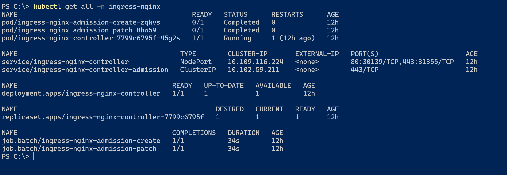
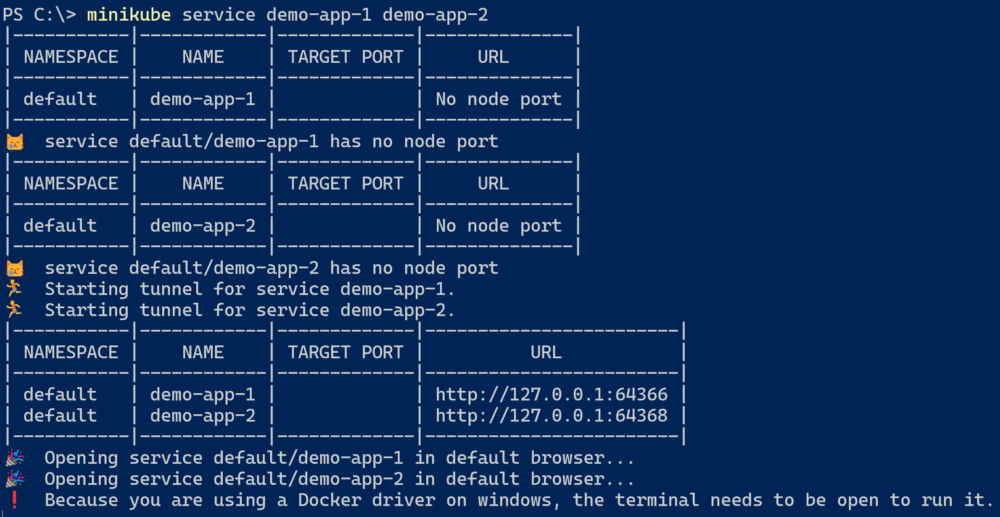
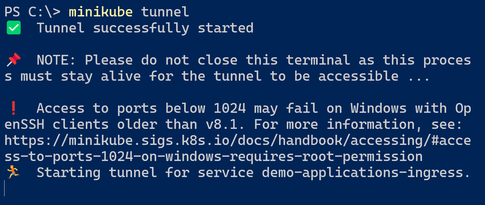

## Ingress

For this part we're using minikube to look at ingress and routing rules.

In minikube we need to enable the ingress-addon:

```
minikube addons enable ingress
```

##### Alternatives
If you run this lab with microk8s, you can run: `microk8s enable ingress`, both options give you a Nginx based ingress controller

After enabling ingress you can check what was deployed to Kubernetes:


The main part is the controller pod. This runs the actual [NGINX](https://docs.nginx.com/nginx-ingress-controller/) reverse proxy. 

### Building the demo application

In the folder [another-webapp](another-webapp) there is a Dockerfile to build a container for this lab. Please build inspect and build it. 

Run `docker build . -t webapp:latest`
from the 'another-webapp' folder.

Then publish the image to minikube with `minikube image load webapp:latest`

### Deploy the application
Inspect the deployment.yaml file and run it with `kubectl apply -f deployment.yaml`.
It will create 2 deployments based on the freshly created webapp.

Check both services with the following command:
`minikube service demo-app-1 demo-app-2`

You should see something like this:


And in your browser you should see the output of both of the applications.

### Adding an ingress

Now it is time to enable the ingress!

```
apiVersion: networking.k8s.io/v1
kind: Ingress
metadata:
  name: demo-applications-ingress
  namespace: default
spec:
  rules:
  - http:
      paths:
      - path: /app1
        pathType: Prefix
        backend:
          service:
            name: demo-app-1
            port:
              number: 8080
  - http:
      paths:
      - path: /app2
        pathType: Prefix
        backend:
          service:
            name: demo-app-2
            port:
              number: 8080
```

For convenience the ingress is available in ingress.yaml.
Add it to the cluster: `kubectl apply -f .\ingress.yaml`

Now we can create a tunnel to the ingress to make it available on localhost (if nothing else is using port 80)

Run:
`minikube tunnel`


Now you should be able to go to http://localhost/app1 and http://localhost/app2.

Or not?
Actually it doesn't work yet.
You could find out by inspecting the ingress-controller pod and see what it logs.

What happens currently is that http://localhost/app1 is forwarded as a request to the webapplication as /app1 or /app2, which is not mapped as an endpoint in the application.
So we need to make sure the url will be rewritten to /.

We do this by changing the ingress.yaml to:
```
apiVersion: networking.k8s.io/v1
kind: Ingress
metadata:
  name: demo-applications-ingress
  namespace: default
  annotations:
    nginx.ingress.kubernetes.io/rewrite-target: "/$2"
spec:
  rules:
  - http:
      paths:
      - path: /app1(/|$)(.*)
        pathType: ImplementationSpecific
        backend:
          service:
            name: demo-app-1
            port:
              number: 8080
```

Do the same for /app2 and reapply it with `kubectl apply -f ingress.yaml`

Now you should see familiair responses.


